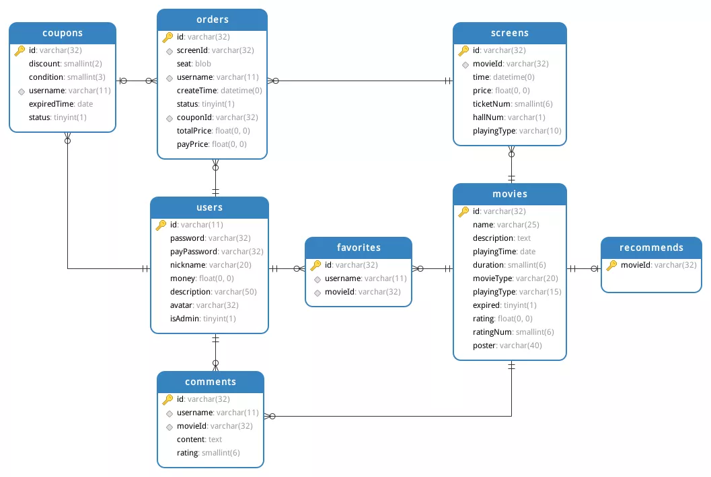
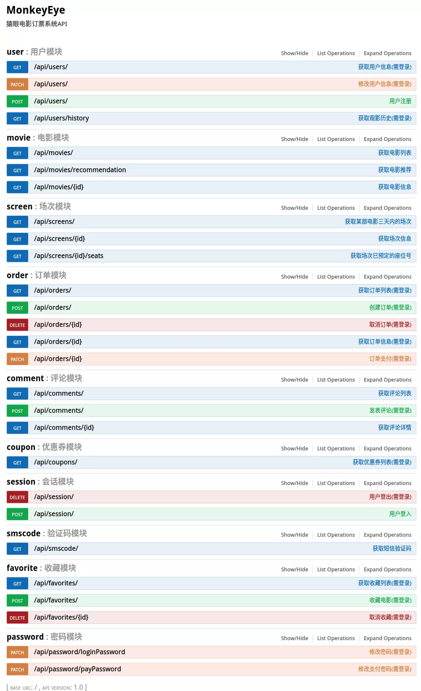

# MonkeyEye-Server

猿眼电影订票系统服务端

## 安装
1. 安装`Python2.7`
2. 安装依赖
```
sudo apt-get install libmysqlclient-dev python-dev redis-server   # Ubuntu 下
sudo yum install mysql-devel python-dev redis                     # CentOS 下
```
3. 克隆仓库后，切换到项目文件夹，在项目文件夹下打开终端，安装虚拟环境virtualenv
```
pip install virtualenv
```
4. 新建虚拟环境
```
virtualenv venv
```
5. 激活虚拟环境
```
source venv/bin/activate       # Linux 下
venv\scripts\activate          # Windows 下
```
6. 安装第三方模块
```
pip install -r requirements
```
## 运行
1. 切换主程序目录
```
cd Flask-Server/
```
2. 运行项目
```
gunicorn -c gunicornConf.py server:app
或者
python server.py
```
**注意** 运行项目前，需要在Flask-Server目录下新建`instance`目录，并在`instance`目录下新建`__init__.py`文件和`config.py`文件，在`config.py`中添加项目的私密配置
```python
SECRET_KEY = 密钥
SQLALCHEMY_DATABASE_URI = 数据库链接
APPKEY = 短信服务key
APPSECRET = 短信服务secret
ADMIN = (管理员用户名, 管理员密码)
MAILSERVER = 邮件服务器
MAILKEY = 邮件服务器key
REDIS = (redis服务器, redis密码)
```
3. 管理系统

运行项目之后访问 http://localhost:5000/admin 进入后台管理系统，访问 http://localhost:5000/swagger 进入 Swagger UI 界面，可查看和测试 API。

## 数据模型

## API

